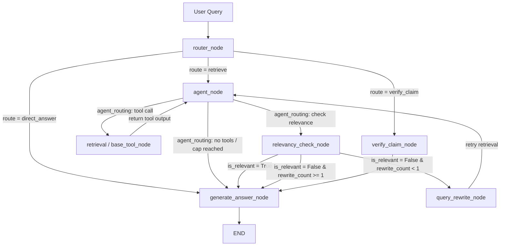

# 📚 Papeer — Research Paper Assistant

Papeer is an advanced, RAG-powered interactive research assistant built using **LangGraph**, **Streamlit**, and **Qdrant**. It helps researchers upload documents (PDFs, Markdown, TXT, web pages), fetch papers directly from ArXiv, and interactively query their personal knowledge base.

It implements a state-of-the-art cognitive agent architecture that automatically routes queries, performs iterative web/vector database searches, evaluates chunk relevancy, rewrites search queries dynamically when search results are poor, and verifies scientific claims against recent literature.

---

## 🏗️ System Architecture

Papeer uses a multi-branch state machine (graph) orchestrated via **LangGraph**. Below is the layout of the graph execution:



### Key Components of the Pipeline:

1. **Intelligent Router**: Directs the query to `retrieve` (academic papers/web resources), `verify_claim` (fact-checking literature), or `direct_answer` (standard training data response).
2. **Iterative Retrieval Agent**: A bounded loop that performs tool actions (`retrieve_from_vectorstore` and `web_search` via Tavily) up to 3 times to construct comprehensive context.
3. **Relevancy Assessment**: An LLM-in-the-loop evaluator checks if retrieved text answers the query.
4. **Query Rewriter**: If the evaluation fails (relevancy is negative), the agent automatically rewrites the query using more precise keywords and retries search execution.
5. **Claim Verification Node**: Searches both the web and arXiv to check if a specific scientific claim has been superseded or updated by more recent literature.

---

## 🛠️ Technology Stack

- **Frontend**: [Streamlit](https://streamlit.io/)
- **Orchestration**: [LangGraph](https://github.com/langchain-ai/langgraph) & [LangChain](https://github.com/langchain-ai/langchain)
- **Vector Database**: [Qdrant](https://qdrant.tech/) with Cache-Backed [OpenAI Embeddings](https://platform.openai.com/docs/guides/embeddings) (`text-embedding-3-small` / Blake2b local key encoder)
- **LLMs**: OpenAI `gpt-5-mini` & `gpt-5.4-mini`
- **Fact-Checking & Web Search**: [Tavily AI](https://tavily.com/)
- **Evaluation**: [DeepEval](https://github.com/confident-ai/deepeval)
- **Environment Management**: [uv](https://github.com/astral-sh/uv) (fast Python package installer)

---

## 📁 Repository Structure

```text
├── backend/
│   ├── btw_handler.py     # Off-topic /btw channel handlers
│   ├── models.py          # Pydantic data schemas for structured outputs
│   ├── paper_loader.py    # Document loading (PDF, TXT, MD, Web, ArXiv) and splitting
│   ├── rag_graph.py       # LangGraph state machine structure and nodes
│   └── vector_store.py    # Qdrant client connection and embedding setup
├── documents/             # (Optional) Target directory for raw PDF documents
├── embedding_cache/       # Cache directory for paper embeddings
├── app.py                 # Streamlit web application
├── evaluate.py            # DeepEval automated test suite
├── goldens.json           # DeepEval generated test case datasets
├── pyproject.toml         # Python project configuration and dependencies
└── sessions.json          # Persistent user chat sessions and metadata
```

---

## 🚀 Getting Started

### 1. Clone the Repository

First, clone the repository to your local machine and navigate into the project directory:

```bash
git clone https://github.com/Mahesh0426/Research_assistantLLM.git
cd Rag_Papeer_Research_paper_Assistant
```

### 2. Prerequisites

- **Python**: `>=3.14`
- **uv** (recommended): Follow the [uv installation guide](https://github.com/astral-sh/uv) to install it, or use standard pip.

### 3. Environment Setup

Copy the environment template (if available) or create a `.env` file in the root directory:

```ini
OPENAI_API_KEY="your-openai-api-key"
TAVILY_API_KEY="your-tavily-api-key"
QDRANT_URL="your-qdrant-cluster-url"
QDRANT_API_KEY="your-qdrant-api-key"
```

### 4. Install Dependencies

Using **uv**:

```bash
uv sync
```

Using **pip**:

```bash
pip install -e .
```

### 5. Run the Streamlit Application

Start the Papeer assistant UI:

```bash
uv run streamlit run app.py
```

Open [http://localhost:8501](http://localhost:8501) in your browser.

### 6. Run the Automated Evaluations

Papeer runs context and faithfulness checks using DeepEval:

```bash
uv run python evaluate.py
```

This runs test cases against `documents/Openclaw_Research_Report.pdf`, generates test cases in `goldens.json` if they do not exist, and outputs results in `eval_results.json`.

---

## 💻 How to Use in Your Code

You can easily reuse Papeer's backend modules in your own Python projects.

### 1. Loading and Chunking Documents

Use [paper_loader.py](file:///Users/maheshkunwar/Documents/Dented_code/AI%20Project/Rag_Papeer_Research_paper_Assistant/backend/paper_loader.py) to load and split files or remote websites programmatically.

```python
from backend.paper_loader import load_document

# Load local PDFs, text, Markdown, or web pages
docs = load_document("path/to/paper.pdf")
print(f"Loaded {len(docs)} document chunks.")
print("Chunk content preview:", docs[0].page_content[:200])
```

### 2. Indexing Documents to Qdrant

Use [vector_store.py](file:///Users/maheshkunwar/Documents/Dented_code/AI%20Project/Rag_Papeer_Research_paper_Assistant/backend/vector_store.py) to add split documents into a custom Qdrant collection associated with a session:

```python
from backend.paper_loader import load_document
from backend.vector_store import add_paper, list_papers

session_id = "user-session-abc"
docs = load_document("path/to/paper.pdf")

# Indexing chunks into Qdrant
add_paper(docs, session_id=session_id)

# Fetch titles of all loaded papers in this session
papers = list_papers(session_id)
print("Indexed Papers:", papers)
```

### 3. Querying the LangGraph RAG Agent

Use [rag_graph.py](file:///Users/maheshkunwar/Documents/Dented_code/AI%20Project/Rag_Papeer_Research_paper_Assistant/backend/rag_graph.py) to compile and invoke the graph state machine:

```python
from langchain_core.messages import HumanMessage
from backend.rag_graph import build_graph

# Compile the graph with persistent SQLite checkpointer
graph = build_graph(db_path="checkpoints.db")

# Define the user query & session configuration
config = {"configurable": {"thread_id": "user-session-abc"}}
input_state = {
    "messages": [HumanMessage(content="What are the key results of the paper?")],
    "session_id": "user-session-abc",
    "query": "What are the key results of the paper?",
    "route": None,
    "retrieved_docs": [],
    "retrieval_attempts": 0,
    "claim_verdict": None,
    "claim_source": None,
    "superseding_papers": [],
    "answer": None,
    "is_relevant": None,
    "rewrite_count": 0,
}

# Stream node execution
for event in graph.stream(input_state, config, stream_mode="values"):
    if "answer" in event and event["answer"]:
        print("\n--- Final Agent Answer ---")
        print(event["answer"])
```

### 4. Direct /btw Side-Channel Queries

Use [btw_handler.py](file:///Users/maheshkunwar/Documents/Dented_code/AI%20Project/Rag_Papeer_Research_paper_Assistant/backend/btw_handler.py) to handle light, off-topic or general web search queries that bypass checkpointers:

```python
from backend.btw_handler import handle_btw

# Queries that may or may not need a web search
query = "What is the current stock price of Apple?"
response_generator = handle_btw(query)

for chunk in response_generator:
    print(chunk, end="", flush=True)
```
